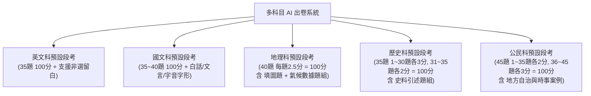

# 全科考卷預設常規模板與規格標準書 (國文、英文、地理、歷史、公民)

> **版本**：v1.0 (實體試卷真實規格認證版)  
> **制定日期**：2026-10-04  
> **參考來源**：專案目錄下真實試卷（115年國文會考、115年英文會考、臺中市立大業國中八年級地理、歷史、公民段考試卷）  
> **適用範圍**：做為「多科目 AI 教材出卷系統」各科預設段考模板與格式生成的系統標準規範。

---

## 一、 各科考卷讀取驗證與可行性報告

經由系統深度讀取與文字結構解析，專案目錄中所有科目試卷**全部 100% 成功讀取且解析完整**，無任何亂碼、掉字或格式毀損問題：

| 科目試卷檔案 | 頁數 | 總題數 | 滿分 | 排版特徵 | 關鍵命題特徵與素材 | 規格可行性評估 |
| :--- | :---: | :---: | :---: | :--- | :--- | :---: |
| **國文會考** (`115P_Chinese.pdf`) | 15 頁 | 42 題 | 標稱100% | 標準雙欄、引文框、詩詞置中、生字夾註 | 字音字形、六書書法、現代科普題組、明清散文、先秦寓言 |  **100% 可行** |
| **英文會考** (`115P_Reading.pdf`, `Listening`) | 15+6 頁 | 43+21 題 | 標稱100% | 雙欄、選項自適應、題組生字註腳、聽力腳本 | 單選字彙語法、長短篇閱讀、克漏字、聽力三部曲 |  **100% 可行** |
| **地理段考** (`地理段考考卷.pdf`) | 4 頁 | 40 題 | **100 分** | 雙欄、高達 16 張地圖與示意圖、氣候數據表 | **一、填圖選擇題 (1~14題)**、板塊氣候選擇、**二、氣候數據題組** |  **100% 可行** |
| **歷史段考** (`歷史段考考卷.pdf`) | 4 頁 | 35 題 | **100 分** | 雙欄、史料引言框、年代對照表 | 晚清貿易硃批史料、**不平等條約條文題組**、**百日維新女學報題組** |  **100% 可行** |
| **公民段考** (`公民段考考卷.pdf`) | 4 頁 | 45 題 | **100 分** | 雙欄、(甲)(乙)(丙)(丁) 組合式選項、案例框 | 選舉四原則、地方自治事項、單一選區兩票制、時事社會服務 |  **100% 可行** |

---

## 二、 五大科目「預設段考常規模板」標準矩陣

未來老師在網頁前端選擇任一科目時，系統將自動載入該科目的**「官方預設常規模板」**（老師仍可自由手動增減題數與自訂配分）：

### 1. 英文科：預設段考常規模板 (100分)
- **第一大題：文意字彙選擇 (10 題，每題 2 分，共 20 分)**
- **第二大題：語法與對話選擇 (10 題，每題 2 分，共 20 分)**
- **第三大題：克漏字測驗 (1 組 4 題，每題 2 分，共 8 分)**
- **第四大題：閱讀測驗題組 (3 篇 9 題，每題 3 分，共 27 分)**
- **第五大題：非選擇題（依提示作答與翻譯，共 25 分，按需生成）**

### 2. 國文科：預設段考常規模板 (100分)
- **第一大題：語文常識與字音字形 (10 題，每題 2 分，共 20 分)**：包含國字注音辨析、六書造字原則、成語詞義。
- **第二大題：白話文與生活情境選擇 (15 題，每題 2 分，共 30 分)**：語句修辭、新詩閱讀、現代科普素養。
- **第三大題：文言文與古典詩詞選擇 (5 題，每題 3 分，共 15 分)**：古典寓言、唐宋詩詞主旨與意境推論。
- **第四大題：綜合閱讀題組 (4 組 11 題，共 35 分)**：
  - 題組一：雙文本對讀素養題組（現代生活科普/社群溝通）。
  - 題組二：文言傳記/寓言題組（附字詞夾註）。

### 3. 地理科：預設段考常規模板 (40題，每題 2.5分，共 100分)
- **第一大題：填圖選擇題 (第 1~14 題，每題 2.5 分，共 35 分)**：
  - 給予區域簡圖（如東北亞輪廓、日本四大島、朝鮮半島位置圖），代號標示（甲、乙、丙、丁），題幹例如：`圖(一)中，甲海域為？ (A)日本海 (B)黃海 (C)東海 (D)鄂霍次克海`。
- **第二大題：單選綜合測驗 (第 15~28 題，每題 2.5 分，共 35 分)**：
  - 包含板塊運動、洋流交會、農業型態、工業區區位優勢、時事經貿。
- **第三大題：題組題 (第 29~40 題，共 4 組 12 題，每題 2.5 分，共 30 分)**：
  - 核心題型：**氣候數據表格題組**（提供氣溫與降水量月報表，推論氣候類型、雨季成因與生活調適）。

### 4. 歷史科：預設段考常規模板 (35題，滿分 100分)
- **配分結構**：第 1~30 題每題 3 分（90分）；第 31~35 題每題 2 分（10分），總分剛好 100 分。
- **題型架構**：
  - **核心特色：史料引言框 (Historical Document Excerpts)**：
    題幹常引用古籍原典、皇帝硃批、外交條約節錄或歷史報刊（如《女學報》、馬關條約條文）。
  - **題組題 (2~3 組，每組 2~3 題)**：晚清不平等條約比對、重大歷史改革（自強運動/維新變法）條文分析。

### 5. 公民科：預設段考常規模板 (45題，滿分 100分)
- **配分結構**：第 1~35 題每題 2 分（70分）；第 36~45 題每題 3 分（30分），總分剛好 100 分。
- **題型架構**：
  - **生活時事與社會情境**：如台中綠美圖開幕、強烈冷氣團街友安置自治事項。
  - **組合式代號選項**：廣泛使用 `(甲)(乙)(丙)(丁)` 判斷政府機關層級（如 (A)甲乙 (B)乙丙 (C)丙丁 (D)甲丁）。
  - **圖表題**：政府組織樹狀架構圖、選舉選票票數分配表、地方自治事權分類表。

---

## 三、 多科目繪圖外掛庫 (Chart Plugins) 定義

針對各科段考的獨特圖片需求，動態繪圖模組 (途徑 C) 定義了專屬插件：

1. **地理科圖表插件**：
   - `@register("geo_map_labeling")`：區域地圖並於指定坐標自動打上「甲、乙、丙、丁」標籤。
   - `@register("climate_data_table")`：生成標準月均溫與月降水量統計表格。
2. **歷史科圖表插件**：
   - `@register("history_timeline")`：歷史年代時間軸（標註重大戰役或條約簽訂順序）。
3. **公民科圖表插件**：
   - `@register("gov_org_chart")`：中央與地方政府組織架構分流樹狀圖。
4. **國文科圖表插件**：
   - `@register("chinese_infographic")`：圖文互轉素養長條圖/流程圖。
5. **英文科圖表插件**：
   - `@register("supermarket_layout")`、`@register("sdg_bar_chart")` 等。
