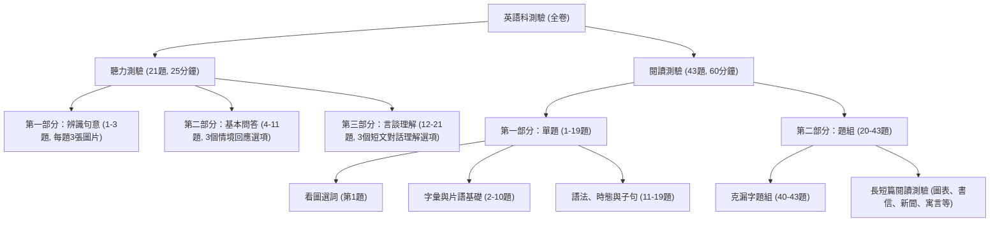

# 國中英文科考卷格式規格標準書 (Agent 出題與排版專用規範)

> **版本**：v1.0 (基於 115 年國中教育會考英語科與國中段考標準制定)  
> **適用對象**：本專案所有出題 Agent、排版 Agent、審題 Agent、以及後台程式模組  
> **使用目的**：確保所有 Agent 產出的考卷題目、格式、難度分佈、圖表結構皆高度一致，並能無縫銜接後台 Word/PDF 排版引擎。

---

## 一、 試卷整體結構與題型分布規範

考卷包含兩種標準架構：**「會考標準規格 (43題)」** 與 **「學校段考標準規格 (30~35題)」**。Agent 出題時預設依指定之規格生成。

### 1. 會考標準架構 (參考 115 年國中教育會考)



### 2. 學校段考常見規格 (各校標準段考卷)
- **第一部分：單選題 (40~50%)**：字彙測驗 (8~10題)、語法與對話測驗 (10~12題)。
- **第二部分：克漏字與閱讀題組 (30~40%)**：克漏字 1 組 (3~4題)、閱讀題組 2~3 組 (6~8題)。
- **第三部分：非選擇題/素養題 (10~20%)**：依提示改寫句子、引導式中翻英、單字填空。

---

## 二、 版面與排版視覺標準 (Visual Layout Spec)

所有題目生成後，需符合以下版面排版規則（Word 範本與 Markdown 預覽均須一致）：

### 1. 頁首與頁尾標註 (Header & Footer)
- **試卷頭部**：
  ```text
  [學校/機構名稱] [學年度學期] [年級] 英語科 [第一次/第二次/期末] 評量試題
  班級：________ 座號：____ 姓名：____________ 得分：________
  ```
- **頁尾標記**：
  - 各頁置中或右側註明頁碼：`第 X 頁 / 共 Y 頁`
  - 非最後一頁之頁底右側標註：`[請翻頁繼續作答]`
  - 全卷結束最後一頁標註：`【試題結束，請仔細檢查！】`

### 2. 題目與選項排版規則
1. **題號標準**：阿拉伯數字加半形句點加半形空格，例如 `1. `、`12. `。
2. **題幹挖空標記**：統一使用半形底線 5 個字元 `_____`，若文末挖空則加句點 `_____.`。
3. **選項格式**：統一使用大寫英文字母加半形括號，如 `(A)`、`(B)`、`(C)`、`(D)`。
4. **選項排列三種版型（依選項字元長度自動決定）**：
   - **單行橫排 (Single Line)**：適用於單字或極短片語（長度 $\le 12$ 字元）。
     ```text
     2. Rita _____ her dogs many times a day. That's why they're too fat.
        (A) feeds    (B) kisses    (C) walks    (D) washes
     ```
   - **雙欄對齊 (Two-Column 2x2 Grid)**：適用於中等長度片語（長度 13~25 字元）。
     ```text
     11. I thought the girl was Kate, but it was her sister, Candy.
         (A) answered the phone        (B) she answered the phone
         (C) who answered the phone    (D) and answered the phone
     ```
   - **四行垂直排列 (Vertical 4 Lines)**：適用於完整長句子（長度 $> 25$ 字元）。
     ```text
     24. Which question can the brochure answer?
         (A) Can I order tickets online?
         (B) How much are the tickets for students?
         (C) How can I get to the Marigolds’ Home by train?
         (D) What time does the gift shop open on Sundays?
     ```

### 3. 題組 (Reading Passages) 排版規則
1. **題組範圍標示**：題幹開頭獨立一行居中或靠左粗體標示，例如 `(20-21)` 或 `【第 20-22 題為題組】`。
2. **文本呈現**：
   - 題組短文左右各縮排 2 字元，行距 1.15 倍，段落間留白 0.5 行。
   - 文章若為特定文體（信件、對話、公告、海報、新聞），須加上對應之文字外框或標題裝飾。
3. **生字註腳 (Footnote / Word Bank)**：
   - 放置於文章結束後的右下方或下方分隔線後。
   - 格式：` [英文單字] [繁體中文釋義]`（符號統一使用 `` 或 `*`）。
   - 範例：` stir 攪拌     brochure 宣傳手冊     ingredient 食材`

---

## 三、 Bloom 認知層次出題控制規範 (Cognitive Dimension Matrix)

出題 Agent 在產生考卷時，**必須嚴格依照老師選定的 Bloom 認知層次比例配置題目**。以下為國中英文科四個認知層次的具體對應：

| Bloom 認知層次 | 英文評量核心能力 | 國中英文對應題型 | 題幹關鍵引導詞 (Prompt Triggers) | 標準配比推薦 (會考/段考) |
| :--- | :--- | :--- | :--- | :---: |
| **1. 記憶 (Remembering)** | 基礎單字詞義、基本文法規則、片語固定搭配、課文直接細節記憶 | - 基礎單字填空/選擇<br>- 不規則動詞三態<br>- 基本文法代名詞/介系詞 | - Which of the following means...?<br>- What did the author do first?<br>- Look at the picture. What is...? | **20% ~ 25%** |
| **2. 理解 (Understanding)** | 段落主旨、因果辨識、代名詞指涉、圖表訊息擷取、文意同義替換 | - 主旨大意題 (Main idea)<br>- 圖片/地圖閱讀理解<br>- 代名詞指涉題 (What does "it" refer to?) | - What is the reading mainly about?<br>- According to the table, which is true?<br>- Why did... because...? | **30% ~ 35%** |
| **3. 應用 (Applying)** | 語境文法遷移、新情境生活應用 (看菜單算金額、看課表規劃行程)、克漏字脈絡填空 | - 跨情境素養題 (菜單、火車時刻表)<br>- 克漏字時態與連接詞選擇<br>- 實用生活對話回應 | - If Peter wants to ..., what should he buy?<br>- Which line should Sandy take to get to...?<br>- Complete the dialogue based on the situation. | **25% ~ 30%** |
| **4. 分析 (Analyzing)** | 言外之意推論 (Inference)、作者觀點態度辨識、批判性思維、篇章結構與邏輯矛盾辨識 | - 推論判斷題<br>- 作者語氣/目的題<br>- 非連續文本跨篇比對<br>- 雙方論點辯論比對 | - What can we infer from the dialogue?<br>- What is the tone of the writer?<br>- Which statement would the author probably agree with? | **15% ~ 20%** |

---

## 四、 圖片與表格規格標準 (Images & Tables Spec)

### 1. 考卷圖片規則
1. **圖片用途分類**：
   - `Type-A (單題看圖選詞)`：每題 1 張情境簡圖，置於題幹上方或下方，寬度限制為 6~8 cm。
   - `Type-B (聽力辨識句意)`：每題 3 張並排選項圖 `(A)`、`(B)`、`(C)`，寬度每張約 4.5 cm。
   - `Type-C (題組非連續文本)`：宣傳海報、時刻表、地圖、漫畫連環圖，寬度限制為 12~14 cm（全欄或跨欄置中）。
2. **技術可行性與規範**：
   - Agent 出題時，若指定需要圖片，必須在 JSON 中提供精確的 `image_prompt`（用於 AI 生圖），或提供 `image_asset_id`（直接引用教材資料夾現有圖片）。
   - 圖片在 Word 檔中必須設定為「文字在線上方與下方 (Inline with text)」，避免跑版。

### 2. 考卷表格規則
1. **表格寬度**：必須符合雙欄（約 8.5 cm 寬）或單欄（約 17.5 cm 寬），不得超出邊界。
2. **文字格式**：表格內部字型大小統一為 9~10 pt（較題幹小 1 pt），行距設為單行。
3. **邊框線條**：表頭加粗底線（1 pt），內部格線為細線（0.5 pt）或淡灰色線。

---

## 五、 出題 Agent 結構化輸出協定 (JSON Output Protocol)

為了確保後台 Python 腳本能夠 100% 精確解析並填入 Word/網頁中，**出題 Agent 必須遵循以下標準 JSON Schema**：

```json
{
  "exam_metadata": {
    "title": "國中七年級英語科第二次評量試卷",
    "grade": "Grade 7",
    "subject": "English",
    "time_limit_minutes": 45,
    "total_score": 100,
    "bloom_distribution": {
      "remembering_pct": 20,
      "understanding_pct": 35,
      "applying_pct": 25,
      "analyzing_pct": 20
    }
  },
  "sections": [
    {
      "section_id": "part_1",
      "section_name": "第一部分：單題 (第 1-15 題，每題 2 分)",
      "questions": [
        {
          "question_number": 1,
          "bloom_level": "remembering",
          "unit_source": "L01",
          "has_image": true,
          "image_description": "A boy wearing a cap and running in the school gym",
          "stem": "Look at the picture. The boy who is running in the gym is wearing a _____.",
          "options": {
            "A": "cap",
            "B": "jacket",
            "C": "glasses",
            "D": "mask"
          },
          "answer": "A",
          "explanation": "圖中跑步的男孩頭上戴著鴨舌帽 (cap)，故選 (A)。",
          "layout_mode": "single_line"
        }
      ]
    },
    {
      "section_id": "part_2",
      "section_name": "第二部分：題組 (第 16-25 題，每題 3 分)",
      "passages": [
        {
          "passage_id": "P01",
          "passage_type": "brochure",
          "unit_source": "L08",
          "title": "SuperMart Opening Sale!",
          "content": "Welcome to SuperMart! We offer fresh fruit and drinks every day...\nOpening hours: 8:00 AM - 10:00 PM.",
          "footnotes": [
            {"word": "discount", "meaning": "折扣"},
            {"word": "receipt", "meaning": "收據"}
          ],
          "has_table": false,
          "questions": [
            {
              "question_number": 16,
              "bloom_level": "understanding",
              "stem": "What time does SuperMart close at night?",
              "options": {
                "A": "At 8:00 AM.",
                "B": "At 10:00 AM.",
                "C": "At 8:00 PM.",
                "D": "At 10:00 PM."
              },
              "answer": "D",
              "explanation": "短文中指出營業時間為 8:00 AM - 10:00 PM，故晚上 10 點關門，選 (D)。",
              "layout_mode": "two_column"
            }
          ]
        }
      ]
    }
  ]
}
```

---

## 六、 評分指引與解答解析本規格

每次出題除產生「學生作答卷 (Question Paper)」外，必須同時產出**「教師解答與解析本 (Answer Key & Explanations)」**，內容須包含：
1. **簡明答案速查表**：矩陣式排列（如 1~5: ABDCA, 6~10: BCDAB...）。
2. **逐題精闢解析**：包含【考點說明】、【語境翻譯】、【解題思路】、【干擾選項剖析】。
3. **難度與素養指標檢核**：每題標註其 Bloom 認知層次、教材對應單元、以及 108 課綱核心素養代碼（如 英-J-B1 符號運用與溝通表達）。
